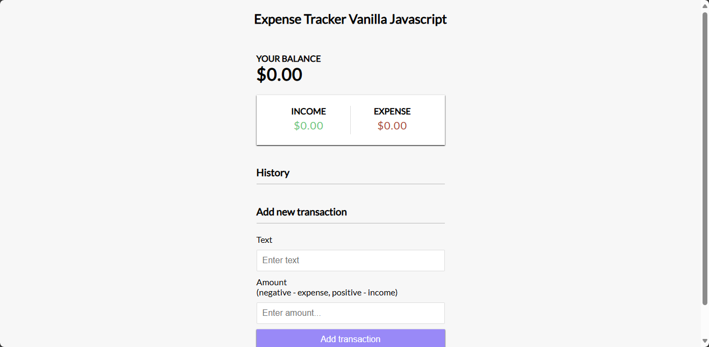

# Expense Tracker App Vanilla Javascript

The Expense Tracker App - Vanilla Javascript tracks an individual's income and expenses and displays the balance.  The web application is developed with vanilla Javascript.

## Project Specifications

- Create Responsive UI for project
- Display transaction items in DOM
- Show balance, expense, and income totals
- Add new transation and reflect in total
- Delete items from DOM
- Persist to local storage
